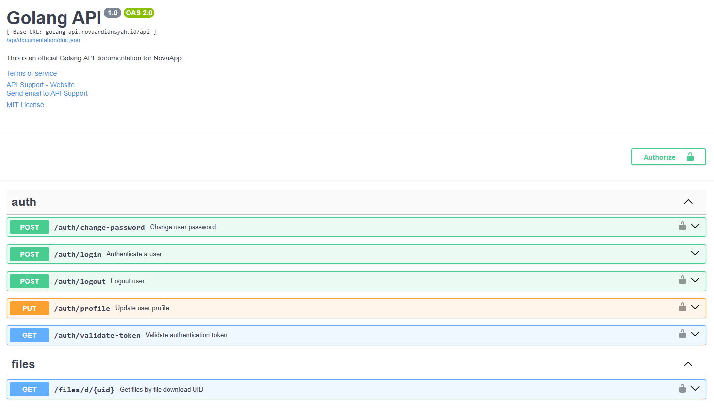

# Golang REST API

Hi Future Developer,

Welcome to the **Golang REST API**! This project is an open-source RESTful API built with the Go programming language, designed with a clean and scalable architecture to build robust backend systems.

This project is an evolution and upgrade of the previous [personal-v4](https://github.com/novaardiansyah/personal-v4) project, which utilized Laravel as the backend for the mobile app. By migrating to Go, this API aims to achieve superior scalability and performance, providing a more efficient foundation for the [NovaApp](https://github.com/novaardiansyah/NovaApp) ecosystem.

## Dazzling Tech Stack

- [Go (Golang)](https://go.dev/) - Fast, statically typed, compiled programming language
- [Fiber](https://gofiber.io/) - Express-inspired web framework for Go
- [GORM](https://gorm.io/) - Fantastic ORM library for Golang
- [MySQL](https://www.mysql.com/) - Database Management
- [Validator](https://github.com/thedevsaddam/govalidator) - Go Struct and Field validation

## API Documentation

This project includes **integrated API documentation** powered by [Swag](https://github.com/swaggo/swag). Access it at: [https://golang-api.novaardiansyah.id/api/documentation](https://golang-api.novaardiansyah.id/api/documentation)

> **Note:** The API documentation provides a complete reference for all available endpoints, request parameters, and response formats. Please note that most endpoints require authentication with a personal access token.

## Mobile App Integration

This project is built to work seamlessly with the **NovaApp** mobile application. NovaApp is a modern finance management app built with React Native, Expo, and TypeScript.

- **Mobile App Repository**: [https://github.com/novaardiansyah/NovaApp](https://github.com/novaardiansyah/NovaApp)

## Credentials & Environment

While this repository is public, please note that all forms of credentials, API keys (including `.env`), and environment configurations are **not provided for the public**. Access to production secrets remains restricted for security reasons.

If you are interested in using this project for specific purposes or require a demo environment, please contact me directly for **exclusive permission**.

## Let's Connect

Need to chat? Feel free to drop me a line via [Email](mailto:novaardiansyah78@gmail.com) or hit me up on [WhatsApp](https://wa.me/6289506668480?text=Hi%20Nova,%20I%20have%20a%20question%20about%20your%20project%20on%20GitHub:%20https://github.com/novaardiansyah/golang-api). I'm just a message away, ready to groove with you!

## Project Status

## Code of Conduct

We believe in fostering a welcoming and inclusive environment for everyone. Please be respectful, considerate, and constructive in all interactions. By participating in this project, you agree to uphold our [Code of Conduct](CODE_OF_CONDUCT.md). Let's collaborate and make this community awesome together!

## Licensing Groove

Exciting news! This project is grooving to the rhythm of the [MIT License](LICENSE).

Feel free to use, modify, and share it with the world. Just remember to keep the original license intact. Let's spread the joy of coding together!

---

**Happy coding and collaborating!**
— Nova Ardiansyah
